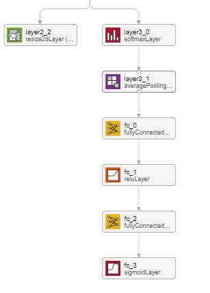
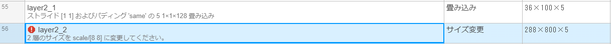
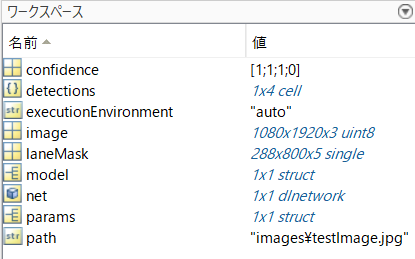
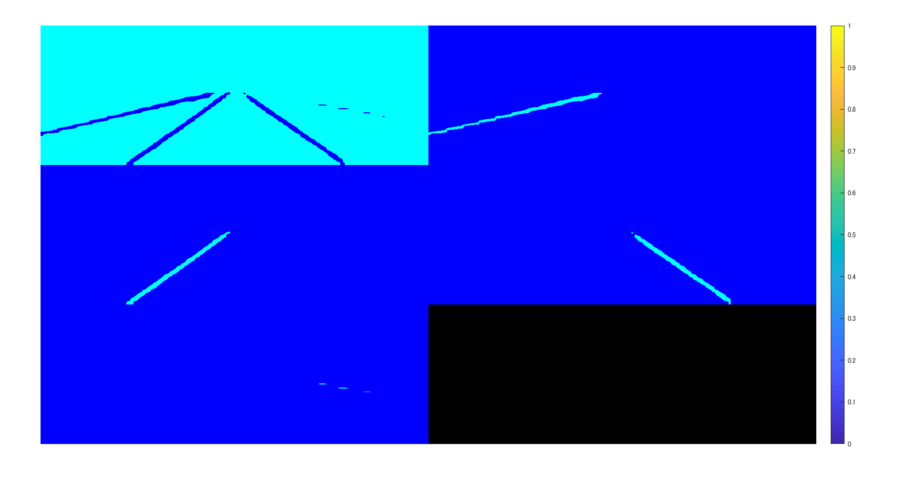
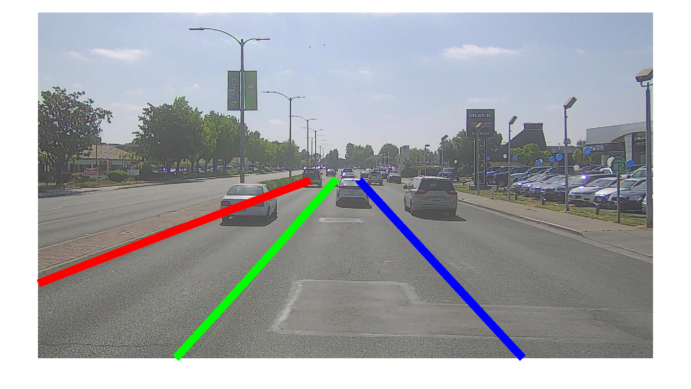
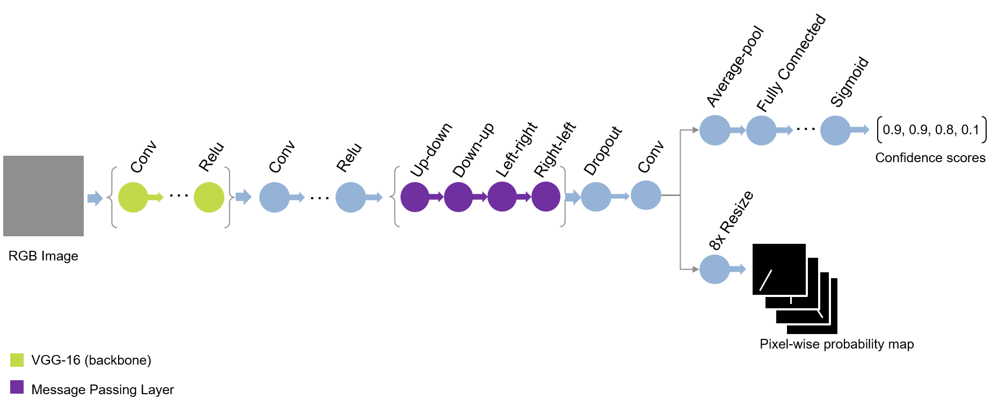
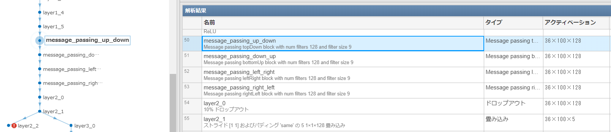

# Spatial CNNを用いた車線検出
# はじめに

Spatial CNNとよばれる手法を用いて、運転動画から車線検出を行います。ここで得られる結果の例を以下に示します。自分のいるレーンの車線とその横の車線の合計４つの線が検出されています。こちらは車載カメラからの動画を入力とし、深層学習ネットワークを用いて車線の検出を行っています。本記事には、誤りや誤字を含んでいる可能性があります。もし気づかれた方は教えていただけますと幸いです。

\matlabheading{}

動画出展：こちらの動画は、映像素材さまの「[車載動画　４K　夕方の東京スカイツリー【無料フリー動画素材】/japan free video](https://www.youtube.com/watch?v=8yH1EAren4E&list=PLHeCRliyeMikjd1njQA7gzqjiuC-WraR5&t=0s)」より、使わせていただきました。ありがとうございました。

# コード

[こちら](https://github.com/matlab-deep-learning/pretrained-spatial-CNN)にある、spatial CNNのMATLAB実装のコードを用いて行います。作成者のricheek-MWさまに感謝いたします。githubからダウンロードとし、ZIPファイルを解凍するか、gitbashでgit cloneコマンドを用いるなどして、ダウンロードしてください。

# Spatial CNNについて：もととなる論文のイントロダクションの和訳

こちらの手法については、もととなっているPanら (2018)の論文のイントロダクションの部分を読むのが良いと思います。以下に、和訳を掲載します。一部、筆者の解釈による意訳を含みます。

========================================================

　近年、自動車の自律走行は学術界や産業界で大きな注目を集めている。その自律走行における最も困難な課題の一つは、その場の交通状況の理解であり、例えば、自動的に周辺環境を理解するために、画像を用いて車線を検出したり、セマンティックセグメンテーションなどが行われてきた。車線の検出は、車線変更など車両を自動的に移動させる際に役立ち、運転支援システムに利用される可能性がある (Urmson et al. 2008)。一方、セマンティックセグメンテーションは、車両や歩行者などの周囲の物体について、より詳細な位置情報を理解するのに役立つ。しかし、実際のアプリケーションでは、悪天候、薄暗がり、まぶしい光など、多くの厳しい状況があることを考慮すると、これらのタスクは非常に困難である。交通シーンの理解におけるもう一つの課題は、特に車線検出では、検出する物体の構造はあらかじめわかっている場合が多いが（車線は直線である・ポールは鉛直方向にまっすぐ伸びているなど）、実際に取得した画像中では、長い連続した直線や曲線の部分が一部途切れていたり、隠れて一部が見えなくなってしまっているようなケースが多い。例えば、図1(a)の最も上の例では、右側の車が右端の車線標識を完全に隠してしまっている。畳み込みニューラルネットワーク（CNN）ベースの手法（Krizhevsky, Sutskever, and Hinton 2012; Long, Shelhamer, and Darrell 2015）は、強力な画像の認識能力により、その画像中のシーンの理解を一気にレベルアップさせたが、図1の赤いバウンディングボックスに表示されている車線標識や電柱（その物体の領域が長く、一部が隠れてしまっているような物体）のような物体に対する性能はまだ十分でない。

　このように画像認識の方法で行う上では困難である一方で、人間は簡単にその位置を推測し、見えない部分をその前後関係から埋めることができる。そこで、本論文では、深層畳み込みニューラルネットワークをより高度に空間の認識ができるよう、一般化したSpatial CNN（SCNN）を提案する。「レイヤー・バイ・レイヤー」と呼ばれるようなCNNでは、畳み込み層が前の層からの入力を受け取り、畳み込み演算と非線形活性化を適用し、その結果を次のレイヤーに伝達する。そしてこのようなプロセスを繰り返し行う。同様に、本研究で提案する、SCNNでは、特徴マップの行（または列）を１つのレイヤーと見なし、畳み込み演算、非線形活性化演算、和演算を順次適用することで、ディープニューラルネットワークを形成する（おそらく、それぞれの特徴マップごとに独立して畳み込み演算をし、次の層でも、同様の操作を繰り返す、という意味だと思います。N番目の特徴マップが畳み込み演算などを経て、またその結果に対して、同様の畳み込み演算などを行っていくイメージです）。このようにして、同じ層のニューロン間で情報が伝播していくことができる。これは、車線、電柱、隠れた部分のあるトラックなどの構造化された物体に対して、それぞれの層の間で、その演算結果を伝えることができるため、そのネットワークで抽出した空間情報を強化することができ、特に有効である。図1に示すように、従来のCNNによる車線検出の結果が不連続であったり、乱雑であったりする場合でも、SCNNは車線標識や電柱を滑らかさや連続性をよく保ったうえで認識することができている。我々の実験では、SCNNは他のRNNやMRF/CRFベースの手法を大幅に上回り、さらに、より深いResNet-101(He et al. 2016)よりも良い結果を得た。

========================================================

# コードの実行

`spatialCNNLaneDetectionVideoExample.m`を実行すればskyTree.mp4に対して、車線検出が行われ、結果が保存されます。実行にあたっては、もとのgithubページも参照していただければと思います。実行にあたっては、F5ボタンや、実行の緑の三角形のボタンを押せば実行します。

# 内容について：論文の和訳で確認

ここでは、もととなる論文のExperimentの欄のLane Detectionを一部和訳し、本手法の内容を確認します。こちらも、筆者による、勝手な解釈を多く含んだうえで訳しているため、あらかじめご注意ください。

========================================================

一般的な物体検出ではバウンディングボックスが出力として必要である一方、車線検出では 曲線を正確に予測する必要がある。シンプルなアイデアとして、深層学習ネットワークに車線の確率マップを出力させる、というものがあげられる。これはちょうど、セマンティックセグメンテーションタスクと似ていて、各ピクセルの出力を目的としてネットワークを学習させるものである。（筆者追加：セマンティックセグメンテーションでは、各ピクセルに対して、その分類の確率を与え（例：背景 0.4、水 0.1、植物 0.5）、その最も高いものをそのピクセルの分類とする。）しかし、異なる車線を1つのクラスとみなし、後処理として、それらを各車線に分離するのではなく、本手法では、 異なる車線をそれぞれ別のクラスとして認識させるような深層学習ネットワークを構築することを目指す。

深層学習ネットワークに、異なる車線を識別させることで、よりロバストな結果が得られる。そこでは、これらの4つの車線を異なるクラスとみなし、さらに、これとは別の層の浅いネットワークを用いて、その車線自体が存在するかを判定する。（筆者追加：１～４本目の車線の位置を予想するネットワーク＋その車線の予測自体が正しいかどうかを判断するネットワーク）また、テストの際には、確率マップから、車線という曲線に変換する必要がある。図5(b)に示すように、信頼度が0.5より大きい各車線に対して、20点の車線に対応する点を抽出する。そして、その２０個の点に対して、3次スプライン曲線をフィッティングさせ、そのフィッティング結果をもとに曲線を生成し、最終的な予測値とする。

========================================================

# 内容について：コードをもとに確認

具体的に、このネットワークの中身について簡単に触れていこうと思います。まず、MATLAB内のアプリである、deepNetworkDesignerでSpatial CNNの構造を可視化してみます。そうすると、以下のように、２つのアウトプットがあることがわかります。



## 左側の、layer2_2と書かれている層について

こちらは、このネットワークで検出可能な4つの車線＋背景の合計5つのカテゴリーに対し、それぞれのカテゴリーの確率を示すヒートマップのようなものを出力しています。わかりやすくするために、以下にコードを用いて説明します。



```matlab:Code
clear;clc;close all
addpath('src'); % Add path to the source directory
model = helper.downloadSCNNLaneDetection; % Download Pre-trained Network
net = model.net; % import pre-trained Spatial CNN 
params = helper.createSCNNDetectionParameters; % Specify Detection Parameters
executionEnvironment = "auto"; % Specify the executionEnvironmen
path = fullfile("images","testImage.jpg"); % Read the test image.
image = imread(path); % read the test image
[detections, laneMask, confidence] = detectLaneMarkings_modified(net, image, params, executionEnvironment);% Call detectLaneMarkings to detect the lane markings.
```

ここで、`detectLaneMarkings_modified`という、関数を私の方で作成（もとのコードを一部変更）し、srcフォルダ内に格納しています。addpath関数で、srcフォルダーも見えるようになっているので、現在のディレクトリにその関数は存在しませんが実行することができます。

ネットワークの出力の１つである、layer2_2の中身を見ていきます。上のコードでは、imagesフォルダー内のtestImage.jpgに対して、Spatial CNNを適用しています（推論）。



実際にワークスペースを見てみるとlaneMaskとよばれる変数があって、これがlayer2_2の出力に相当します。これがどのような絵になっているか見てみます。montage関数を用いて可視化をしようと思います。

```matlab:Code
% 簡単にするために、FORを使ってCell配列を作ります
labeMask_C=cell(1,5);
for i=1:5
    mask_i=laneMask(:,:,i);
    labeMask_C{i}=label2rgb(round(mask_i)+1);
end
figure;montage(labeMask_C);colorbar
```



このように、５つの画像として、layer2_2の出力結果を可視化することができました。こちらは、背景＋検出可能な自車の左右２つの線の合計４本の線の確率マップになっています。水色に近い方が高い確率を示しています。つまり、左側の最も上にある画像では、背景（つまり車線でない）ピクセルが水色で示されていて、そのほかの画像の水色の部分も確かに車線のような形状になっていることがわかります。

それでは、このテスト画像に対して、どのような車線を出力するか確認してみます。

```matlab:Code
fig = figure;
helper.plotLanes(fig, image, detections);
```



# fc_3の出力について

確かに、右上に伸びる２つの車線（赤と緑）および、左上に伸びる車線（青）を確認することができます。しかし、このネットワークでは４本の車線を検出するはずですが、３つしかないのはなぜでしょうか。それでは、confidenceという変数をみてみます。

```matlab:Code
confidence
```

```text:Output
confidence = 4x1 の single 列ベクトル    
     1
     1
     1
     0

```

すると、1, 1, 1, 0という確信度を得ることができます。これは何かというと、各車線を推定したときのその確信度です。４本目の車線に関しては、確信度が低く、出力されなかったため、今回のテスト画像に関しては３本しか車線が検出されませんでした。なお、今回のコードでは、閾値を0.5とし、それ以下のものは０に、そしてそれ以上のconfidence scoreは１に丸められているため、このように1/0で結果が示されています。

# ネットワークの簡単な概略

ここまでの流れを簡単にまとめると、画像の入力があって、それらに畳み込み演算などを適用します。そして、２つの出力を得ます。１つ目は、背景や車線の確率マップ、そして、２つ目はそれぞれの確信度を示しています。ちょうど以下の図のようになります。下の段の8×Resizeというのは、出力のbicubic補間によって、縦及び横幅を８倍に拡大しています。また、最終的な車線に関しては、`fitPolynomialRANSAC`関数を用いて、フィッティングをして出力しています。次数は2次になっていますが、1次の式でフィッティングすることも可能です。



画像出典：https://github.com/matlab-deep-learning/pretrained-spatial-CNN/blob/main/images/SCNN_architecture.png

# Message Passing Layerについて

このSpatial CNNの特徴として、Message Passing Layerと呼ばれるものが存在します。これをまずはdeepNetworkDesignerをもちいて確認してみましょう。まずは、modelをlaerGraph変数に`deepNetworkDesigner`とタイプして、モデルの可視化を行います。

```matlab:Code
lGraph=layerGraph(model.net);
```

すると、modelの中に、message passing layerなるものが含まれていることがわかります。

さらに、解析ボタンを押す、または、analyzeNetwork(lGlaph)として、ネットワークの解析を行います。

  



ここの、層では、従来のCNNのような、直前の層で得られた演算結果（特徴マップ）全体に対して、畳み込み演算を行うのではなく、各層ごとに独立して畳み込み演算を行います。これによって、長い直線状の画像特徴をうまく捉えることができるようです。実際、出力（アクティベーション）は36×100×128と、出力サイズ自体は変わっていないことがわかります。

up_downなど、方向に関する違いがあります。ここでは、上から下か（または下から上か）、および、左から右か（または右から左か）という合計４パターンが試されていて、４つの層が用意されています。これは畳み込み演算を行うときの方向です。

このような独自のレイヤーに関しては、カスタム定義層として、.mファイルで定義することができます。scr => +layer => MessagePassingLayer.mにファイルが保存されていて、例えば、rightLeftの場合は以下のようにフィルターが移動することがわかります。`i = size(block,sliceDim)-1:-1:1`というように、値が下がるようになっていて、その値が２つ目の入力（左右方向）に影響しています。このように確かに右から左に動くように設計されていることがわかります。

```matlab:Code
function block = rightLeft(net,block)
% Slice along the width.
sliceDim = 2;
for i = size(block,sliceDim)-1:-1:1
    z = predict(net,block(:,i+1,:,:));
    block(:,i,:,:) = block(:,i,:,:) + z;
end
end
```

# その他のテスト動画について

他の動画ファイル（example2.mp4)に関して、推論を行ったときの結果を示します。ここでは、自転車の下側の車線もうまく描けていることがわかります。また、車線を誤って変更したようなイレギュラーな状況でもうまく推論できています。また、黄色い車線に関しては、最後のほうでは推論できていないことがわかります。このモデルの訓練データの[CULane](https://xingangpan.github.io/projects/CULane.html)データセットでは、黄色い車線のようなデータが少なかったことが理由かもしれません。冒頭の夕暮れのデータやこのような晴れのデータでも安定して車線の検出ができていて、素晴らしいモデルだと思いました。例えば、二値化やハフ変換のような従来の方法ではこのような環境の変化に関してはパラメータ調整が必要で、難しい場合が多い一方、このような光環境が変化したり、道路の線がかすれているような状況でも利用可能であるので、さまざまなシーンで広く利用できそうです。


  
# まとめ

この記事では、richeek-MWさんがMATLAB実装したファイルをもとに、Pan et al. (2018)のSpatial CNNを試してみました。自前のデータでもパラメータを変更することもなく、良好な結果を得ることができました。今回の例では自動車の自律走行の支援のための例になっていますが、他の分野でも直線、または曲線を精度よく検出することは多くの場面で重要だと思います。今回は４本の線の抽出ですが、本数を変えたり、最終的な線のフィッティングの方法を変えるなどして、より多用な出力が生み出せるかもしれません。

  
# 参考文献

Pan, X., Shi, J., Luo, P., Wang, X. and Tang, X., 2018, April. Spatial as deep: Spatial cnn for traffic scene understanding. In *Thirty-Second AAAI Conference on Artificial Intelligence*.
